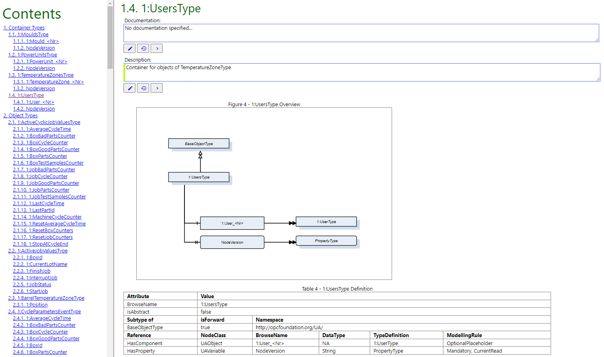
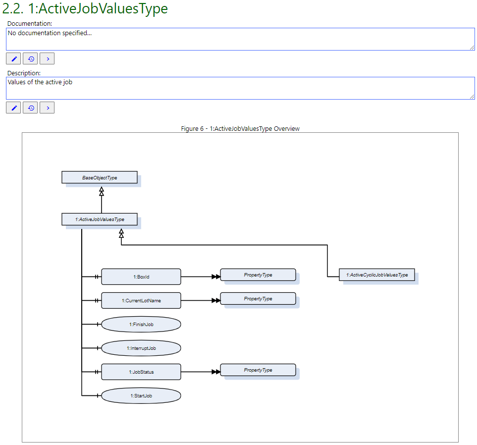
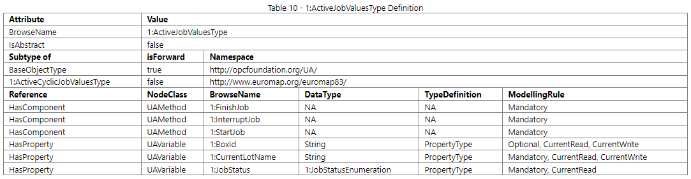
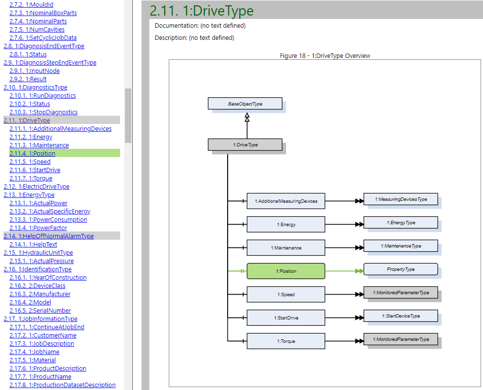
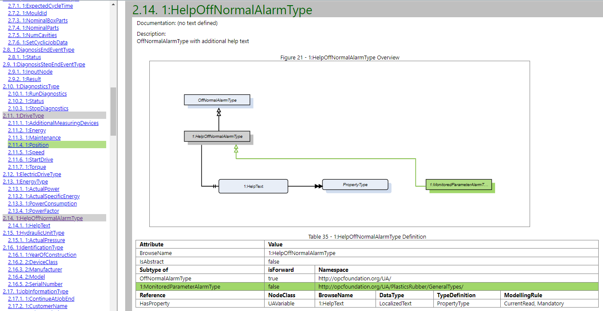

# NodeDoc

NodeDoc is a documentation tool for OPC UA Information Models, also simply called NodeSets.

You can try a demo version of NodeDoc on https://nodedoc-demo.scch.at. Check out the [User Guide](./doc/User-Guide.md) to learn more about on how to use NodeDoc.

If you want to run the full version yourself, continue reading from [Deployment](#deployment).

If you want to further develop NodeDoc, continue reading from [Development](#development).

## Deployment

### Prerequisites

* Java 11
* Maven (tested with 3.8.5)
* Docker
* Docker Compose

### Usage

#### Build NodeDoc

```
mvn package -f visualization -P buildDockerImage
```

#### Create data directories

```
./create-nodedoc-data-dir.sh
```
or
```
.\create-nodedoc-data.dir.bat
```

#### Run application

```
docker compose up
```

#### Configuration

See [docker-compose.yml](./docker-compose.yml) for a list of configuration options

## Development

### Prerequisites

* Docker
* Docker Compose
* Java 11
* Maven (tested with 3.8.5)
* npm (tested with 8.3.1)
* Node.js (tested with 16.14.0)

### Usage

#### Start database for development

```
docker compose up couchdb
```

#### Create data directories for the application

Create the following directories
* C:\Docker\opc_ua\data\nodesets
* C:\Docker\opc_ua\data\templates
* C:\Docker\opc_ua\data\diffs

You can also create directories at a different location and configure them in [application.yaml](visualization/backend/src/main/resources/application.yaml)

#### Compile and run NodeDoc

```
mvn install -f visualization
mvn exec:java -f visualization -pl backend
```

## Example from a generated documentation

The following screenshots were taken from the generated documentation of the version 1.00 (PublicationDate = 20218-05-07) of http://www.euromap.org/euromap83/





## Example from a generated diff

The following screenshots were taken from the diff, which compared the versions 1.02 (PublicationDate = 2020-06-01) and 1.03 (PublicationDate = 2021-05-10) of http://opcfoundation.org/UA/PlasticsRubber/GeneralTypes/




## Publications

### Documenting and Comparing OPC UA Information Models

https://ieeexplore.ieee.org/document/10275554

DOI: 10.1109/ETFA54631.2023.10275554

Stefan Schöberl, Bernhard Dorninger, Albin Kern, Verena Geist

Since its release as an IEC standard series, the OPC Unified Architecture (OPC UA) has become a widely adopted platform for both vertical and horizontal communications as well as data exchange in cyber-physical systems (CPS). A key benefit of OPC UA is its extensible object model, which offers the possibility to define custom information models, which may represent a specific production domain. As these generally represent interfaces for other applications, comprehensible documentation is an essential requirement in most cases.In this paper, we describe an approach to document, maintain and compare versions of OPC UA information models generated from existing code artifacts in the domain of serial machinery engineering. Base for the contribution of this work is the prototype of a documentation and model comparison tool (NodeDoc). We will describe its usage context and requirements as well as its main features. In addition, we discuss encountered challenges and provide insights into proposed solutions along with relevant lessons learned during the development of NodeDoc.