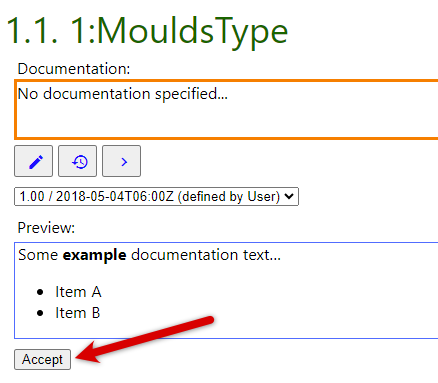
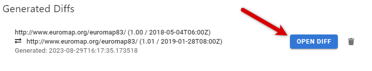

# NodeDoc User Guide

This guide gives an overview of the functionalities of NodeDoc.
Most of these features are available in the demo version of NodeDoc, which can be tried on https://nodedoc-demo.scch.at.
In this demo, a few selected NodeSets are preloaded, whereas in the full version (which can be self-hosted) arbitrary NodeSets can be uploaded.

Features which are exclusive to the full version are labeled explicitly in this guide.

You can either start at [Documentation Generation and Editing](#Documentation-Generation-and-Editing) to try the documentation features or skip right to [Compare NodeSets](#Compare-NodeSets) to visualize the differences between two NodeSet versions.

## Documentation Generation and Editing

### Upload NodeSets

> [!NOTE]
> Full version only

On the Main UI you can upload NodeSet XMLs directly (*NodeSet File Upload*) or via an URL (*NodeSetURL*).

When using the URL option, NodeDoc will attempt to download the NodeSet from the provided URL and store it. This is especially useful for importing standard NodeSets, which are publicly available on the web.

### Generate HTML

To generate documentations for NodeSets, choose a NodeSet from the NodeSet browser and click on the *gear button*.

In the next dialog the selection of template for the generated documentation. In this demo just click on *Generate*, the default template will then be used.

> [!NOTE]
> The full version of NodeDoc supports using custom templates, which are used as a frame for the generated documentation. Checkout [Custom templates](#custom-templates) for details.

After the generation finished, a *HTML button* will appear next to the *gear button*. Clicking on the *HTML button* will open the generated documentation in a new tab.

### Edit documentation

After opening the generated HTML, the documentation and description of nodes, DataType fields and method arguments (in the following simply called *documentation entries*) can be freely edited in the highlighted text areas.
Furthermore, Markdown is supported, which will be rendered when the textare is out of focus (= not currently edited).

### Browse History of documentation entries

If a node has already been documented in other versions of the NodeSets, the history can be shown by clicking on the *History button*.
Now a NodeSet version can be selected and the corresponding text is displayed.

Clicking the *Accept* will import the selected text into the current NodeSet, if the selected text version should be used.
Furthermore, if the original NodeSet XML file contains documentation entries, these texts are also shown in the version selector.

### Re-Export NodeSets

After editing documentation entries of NodeSets, an updated version of the NodeSet XML file can be downloaded, where the current documentation entries are included.
This can be done by clicking on the *Export* button in the NodeSet browser.

### Custom templates

> [!NOTE]
> Full version only

You can start creating own templates based on the default [emptyTemplate.html](../nodedoc/documentation/src/main/resources/emptyTemplate.html).

The template requires two placeholder tags
  * `

` for the main content of the documentation 
  * and `

` for the table of contents.

The tag for table of contents can be omitted, in this case NodeDoc will generate the table of contents as the first child of the ´<body>´. Usually one want to include this tag in the template, if control over the exact position of this element is needed.

## Compare NodeSets

Two versions of the same NodeSet can be compared with each other.
Start by selecting the base version for the comparison by clicking on the *arrows button* of the desired NodeSet version in the NodeSet browser.

A dialog will open. Select the second version for the comparison by clicking on the *arrows button* of the NodeSet version to be compared.

The diff will be generated and can be viewed by clicking on *Open Diff* in the *Generated Diffs* area.

